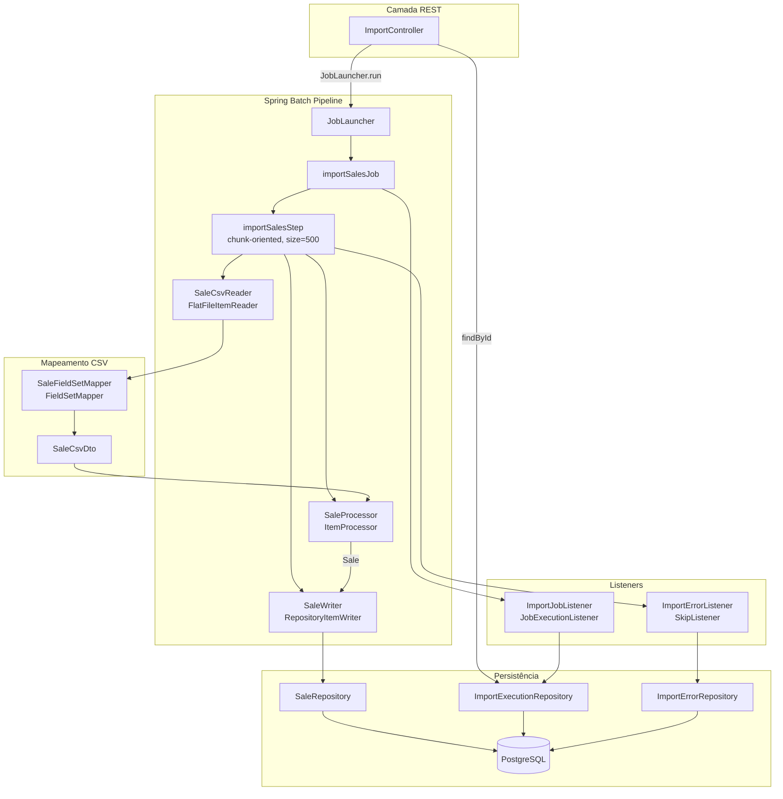
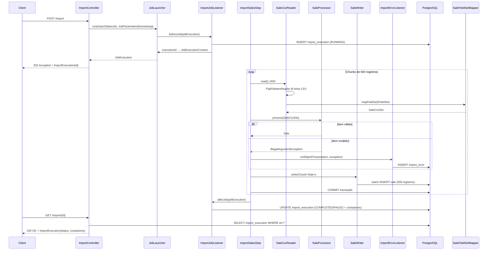
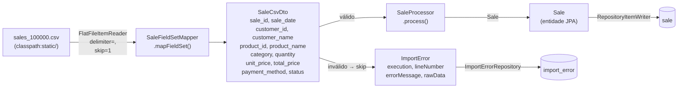
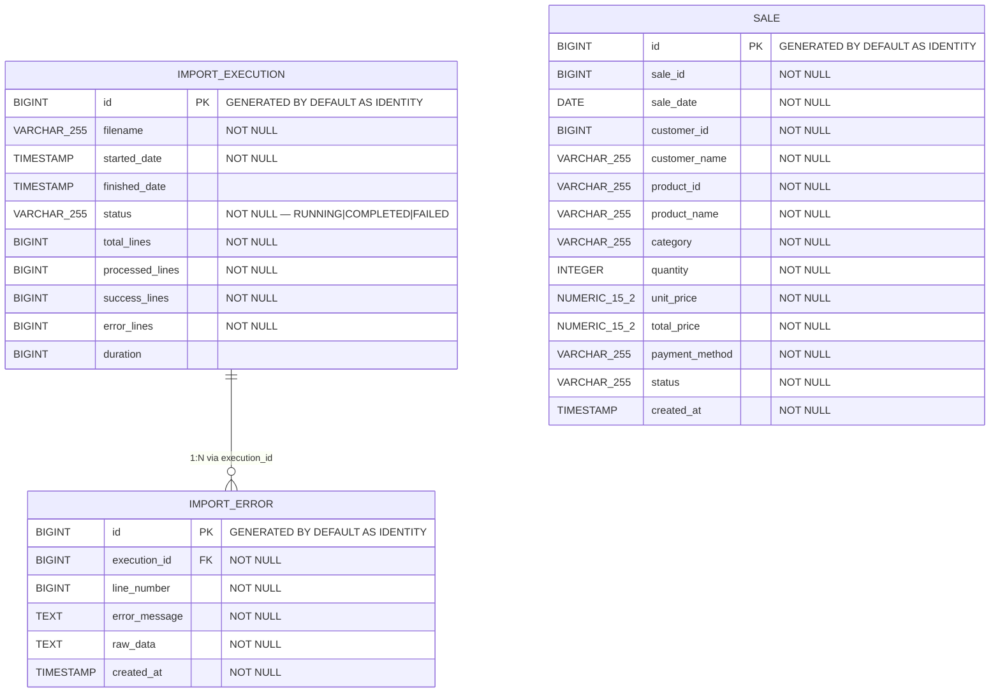

# Design Técnico — spring-batch-csv-importer

## Visão Geral

O `etl-importer` é uma aplicação Spring Boot 4.1 / Java 21 que importa até 100.000 registros de venda de um arquivo CSV para um banco PostgreSQL via Spring Batch. Este documento descreve a arquitetura do pipeline após a migração completa da implementação manual assíncrona (`ImportService`) para a abordagem chunk-oriented nativa do Spring Batch.

A migração resolve um conjunto de inconsistências presentes no código atual — referências a classes inexistentes, package declarations incorretos, schema SQL divergente das entidades JPA, configuração `application.properties` com sintaxe inválida e ausência de fault-tolerance (skip policy) — e acrescenta rastreabilidade completa via `ImportExecution` e `ImportError`.

### Decisões de Design

| Decisão | Escolha | Racional |
|---|---|---|
| Chunk size | 500 | Equilibra pressão de memória com número de commits. Alinhado ao `hibernate.jdbc.batch_size=500` para maximizar JDBC batch inserts. |
| Skip limit | 10.000 (10% de 100.000) | Permite processar arquivos com dados parcialmente sujos sem abortar o job inteiro. |
| Writer | `RepositoryItemWriter` + `SaleRepository.save()` | Reusa a infraestrutura JPA existente; o Hibernate combina com `order_inserts=true` para emitir batch inserts eficientes. |
| Rastreamento | `ImportExecution` gerenciado pelo `JobExecutionListener` | Desacopla o ciclo de vida do job de metadados da aplicação; o `executionId` é propagado via `JobExecutionContext`. |
| `ImportService` manual | Removida | Toda a lógica passa a ser responsabilidade do Spring Batch; manter duas implementações criaria contradição de estado. |
| `AsyncConfig` | Removida | Não há mais processamento assíncrono manual; o Spring Batch gerencia seus próprios threads. |


---

## Arquitetura

### Diagrama de Componentes



### Diagrama de Sequência — Fluxo de Importação




---

## Componentes e Interfaces

### Diagrama de Fluxo de Dados



### Descrição dos Componentes

#### `SaleCsvReader` / `SaleFieldSetMapper`
- `SaleCsvReader` define o bean `FlatFileItemReader<SaleCsvDto>` via `FlatFileItemReaderBuilder`.
- Lê `classpath:static/sales_100000.csv`, pula 1 linha (cabeçalho), delimitador `,`.
- Nomes de colunas declarados: `sale_id`, `sale_date`, `customer_id`, `customer_name`, `product_id`, `product_name`, `category`, `quantity`, `unit_price`, `total_price`, `payment_method`, `status`.
- `SaleFieldSetMapper` converte `FieldSet` → `SaleCsvDto` com conversão de tipos: `Long`, `LocalDate` (formato `yyyy-MM-dd`), `Integer`, `BigDecimal`.
- **Correção necessária:** o `package` em `SaleFieldSetMapper.java` está declarado como `...batch.reader` — deve ser `...batch.mapper`. A injeção em `SaleCsvReader` deve usar o import do pacote correto.

#### `SaleProcessor`
- Implementa `ItemProcessor<SaleCsvDto, Sale>`.
- Validações: `quantity <= 0` → `IllegalArgumentException`; `paymentMethod` não presente em `PaymentMethodEnum` → `IllegalArgumentException`; `status` não presente em `SaleStatusEnum` → `IllegalArgumentException`.
- Mapeamento é case-sensitive via `Enum.valueOf()`.
- **Correção necessária:** remover import de `SaleCsvRecord` (classe inexistente). O arquivo se chama `SalesCsvProcessor.java` mas a classe é `SaleProcessor` — renomear o arquivo para `SaleProcessor.java` para consistência.

#### `SaleWriter`
- Classe de configuração que expõe o bean `RepositoryItemWriter<Sale>`.
- Usa `SaleRepository.save()` como método de persistência.
- Opera dentro da transação gerenciada pelo Step — nenhuma configuração adicional necessária.

#### `ImportSalesStepConfig`
- Define o bean `Step importSalesStep` com:
  - `chunk(500, transactionManager)`
  - `.faultTolerant().skipLimit(10000).skip(Exception.class)`
  - `.listener(importErrorListener)` (novo `SkipListener`)
- **Correção necessária:** substituir referências a `SaleCsvRecord` por `SaleCsvDto`; adicionar fault tolerance; injetar `ImportErrorListener`.

#### `ImportSalesJobConfig`
- Define o bean `Job importSalesJob` com `start(importSalesStep)` e `listener(importJobListener)`.
- Praticamente correto — apenas garantir que o `ImportJobListener` implementa `JobExecutionListener` (já está).

#### `ImportJobListener` (renomeado de `JobExecutionListener`)
- `beforeJob`: cria `ImportExecution` com `status=RUNNING`, `filename="sales_100000.csv"`, todos os contadores em `0L`, persiste via `ImportExecutionRepository` e armazena o `id` gerado em `JobExecutionContext` com a chave `"executionId"`.
- `afterJob`: recupera `executionId` do contexto, calcula contadores (`writeCount` = `successLines`, `skipCount` = `errorLines`, soma = `totalLines`), calcula `duration`, define `finishedDate` e persiste o registro atualizado. Status: `COMPLETED` se `BatchStatus.COMPLETED`, caso contrário `FAILED`.
- **Correção necessária:** implementar toda a lógica de persistência descrita acima (atualmente apenas faz log).

#### `ImportErrorListener` (novo)
- Implementa `SkipListener<SaleCsvDto, Sale>`.
- `onSkipInProcess(SaleCsvDto item, Throwable t)`: recupera `ImportExecution` via `executionId` do `StepExecution.getJobExecution().getExecutionContext()`, cria `ImportError` com os campos `lineNumber` (via `StepExecution.getReadCount()`), `errorMessage` (`t.getMessage()`), `rawData` (representação string do item), persiste via `ImportErrorRepository`.
- **Criação necessária:** classe não existe; stubs `ImportSalesJob.java` e `SaleCsvStep.java` devem ser removidos.

#### `ImportController`
- **Correção necessária:** substituir `ImportService` por injeção direta de `JobLauncher` e `Job importSalesJob`.
- `POST /import`: chama `jobLauncher.run(importSalesJob, new JobParametersBuilder().addLong("timestamp", System.currentTimeMillis()).toJobParameters())`. Retorna `202 Accepted` com o `ImportExecution` criado pelo listener (recuperado via `ImportExecutionRepository` usando o `executionId` do `JobExecutionContext`). Captura `JobExecutionAlreadyRunningException` → `409 Conflict`.
- `GET /import/{id}`: delega para `ImportExecutionRepository.findById(id)` → `200 OK` ou `404 Not Found`.

#### Classes a Remover
- `ImportSalesJob.java` — stub vazio; lógica está em `ImportSalesJobConfig`.
- `SaleCsvStep.java` — stub vazio; lógica está em `ImportSalesStepConfig`.
- `ImportServiceBatch.java` — referencia beans inexistentes, não compila.
- `ImportExecutionService.java` — classe vazia sem responsabilidade.
- `ImportService.java` — implementação manual substituída pelo pipeline batch.
- `AsyncConfig.java` — não há mais processamento assíncrono manual.


---

## Modelos de Dados

### Diagrama ER



### Migrations Flyway Necessárias

As migrations existentes contêm erros que impedem a validação do Hibernate. A correção é feita criando uma nova migration `V5__fix_schema.sql` (assumindo que V4 são as tabelas do Spring Batch geradas por `initialize-schema=always`):

**V5__fix_schema.sql**
```sql
-- Corrige tabela import_execution
ALTER TABLE import_execution
    ADD COLUMN IF NOT EXISTS filename VARCHAR(255) NOT NULL DEFAULT 'unknown';

ALTER TABLE import_execution
    DROP COLUMN IF EXISTS execution_id;

ALTER TABLE import_execution
    RENAME COLUMN total_line TO total_lines;

ALTER TABLE import_execution
    ALTER COLUMN started_date SET NOT NULL;

-- Corrige tabela sale
ALTER TABLE sale
    ADD COLUMN IF NOT EXISTS sale_id BIGINT NOT NULL DEFAULT 0;
```

> **Nota sobre V4:** `spring.batch.jdbc.initialize-schema=always` faz o Spring Batch criar automaticamente suas tabelas de metadados (`BATCH_JOB_INSTANCE`, `BATCH_JOB_EXECUTION`, etc.) no datasource. Essas tabelas não são gerenciadas pelo Flyway.

### Mapeamento FieldSet → SaleCsvDto → Sale

| Campo CSV | Tipo no DTO | Tipo na Entidade | Observações |
|---|---|---|---|
| `sale_id` | `Long` | `Long` | `fieldSet.readLong()` |
| `sale_date` | `LocalDate` | `LocalDate` | `LocalDate.parse(fieldSet.readString())` |
| `customer_id` | `Long` | `Long` | `fieldSet.readLong()` |
| `customer_name` | `String` | `String` | `fieldSet.readString()` |
| `product_id` | `String` | `String` | `fieldSet.readString()` |
| `product_name` | `String` | `String` | `fieldSet.readString()` |
| `category` | `String` | `String` | `fieldSet.readString()` |
| `quantity` | `Integer` | `Integer` | `fieldSet.readInt()` |
| `unit_price` | `BigDecimal` | `BigDecimal` | `new BigDecimal(fieldSet.readString())` |
| `total_price` | `BigDecimal` | `BigDecimal` | `new BigDecimal(fieldSet.readString())` |
| `payment_method` | `String` | `PaymentMethodEnum` | `PaymentMethodEnum.valueOf()` no Processor |
| `status` | `String` | `SaleStatusEnum` | `SaleStatusEnum.valueOf()` no Processor |


---

## Propriedades de Correção

*Uma propriedade é uma característica ou comportamento que deve se manter verdadeiro em todas as execuções válidas de um sistema — essencialmente, uma declaração formal sobre o que o sistema deve fazer. As propriedades servem como ponte entre especificações legíveis por humanos e garantias de corretude verificáveis por máquina.*

### Propriedade 1: Round-trip de mapeamento CSV → DTO

*Para qualquer* `SaleCsvDto` com dados válidos, construir a linha CSV correspondente e processá-la pelo `SaleFieldSetMapper` deve produzir um `SaleCsvDto` equivalente ao original — todos os campos preservados com seus tipos e valores corretos.

**Validates: Requirements 4.4, 4.5**

---

### Propriedade 2: Rejeição de quantity inválida pelo Processor

*Para qualquer* `SaleCsvDto` com `quantity` menor ou igual a zero, a chamada a `SaleProcessor.process()` deve lançar `IllegalArgumentException`.

**Validates: Requirements 5.1**

---

### Propriedade 3: Rejeição de enums inválidos pelo Processor

*Para qualquer* string que não seja um valor válido de `PaymentMethodEnum` ou `SaleStatusEnum`, a chamada a `SaleProcessor.process()` deve lançar `IllegalArgumentException`.

**Validates: Requirements 5.2, 5.3**

---

### Propriedade 4: Mapeamento completo DTO → Sale pelo Processor

*Para qualquer* `SaleCsvDto` completamente válido (quantity > 0, paymentMethod e status com valores existentes nos enums), o `Sale` retornado por `SaleProcessor.process()` deve ter todos os campos equivalentes ao DTO de origem.

**Validates: Requirements 5.4, 5.5**

---

### Propriedade 5: Persistência completa de chunks pelo Writer

*Para qualquer* lista de objetos `Sale` válidos entregue ao `SaleWriter`, todos os registros da lista devem estar presentes no banco de dados após a execução do Writer.

**Validates: Requirements 6.2**

---

### Propriedade 6: Corretude dos contadores da execução

*Para qualquer* execução do Job com N linhas válidas (write count) e M linhas inválidas (skip count), o `ImportExecution` resultante deve satisfazer: `successLines = N`, `errorLines = M` e `totalLines = N + M`.

**Validates: Requirements 7.2**

---

### Propriedade 7: Completude e corretude dos registros de erro por linha

*Para qualquer* conjunto de M itens inválidos processados durante um Job, devem existir exatamente M registros `ImportError` no banco, cada um contendo `errorMessage` não vazio, `rawData` com o conteúdo do item original e `execution` referenciando o `ImportExecution` corrente.

**Validates: Requirements 8.1, 8.3**


---

## Tratamento de Erros

### Estratégia de Fault Tolerance no Step

```
StepBuilder
  .faultTolerant()
  .skipLimit(10000)
  .skip(Exception.class)        // pula qualquer exceção no Processor
  .listener(importErrorListener) // registra cada item pulado
```

O Spring Batch usa retry individual quando detecta um skip: o chunk é reprocessado item a item para isolar o item problemático antes de chamada `onSkipInProcess`.

### Mapeamento de Erros → Respostas HTTP

| Situação | Comportamento |
|---|---|
| Job iniciado com sucesso | `202 Accepted` + `ImportExecution` com `status=RUNNING` |
| Job já em execução (`JobExecutionAlreadyRunningException`) | `409 Conflict` com mensagem descritiva |
| `id` não encontrado em `GET /import/{id}` | `404 Not Found` |
| Arquivo CSV ausente no classpath | Job marcado como `FAILED`; `ImportExecution` atualizado com `status=FAILED` |
| Item com dado inválido (quantity, enum) | Item pulado; `ImportError` registrado; Job continua |
| Skip limit excedido (> 10.000 erros) | Job marcado como `FAILED`; `ImportExecution` atualizado com `status=FAILED` |

### Propagação do `executionId`

O `executionId` do `ImportExecution` é armazenado no `JobExecutionContext` sob a chave `"executionId"` pelo `ImportJobListener.beforeJob()`. O `ImportErrorListener` acessa esse valor via `StepExecution.getJobExecution().getExecutionContext().getLong("executionId")` para associar cada `ImportError` ao `ImportExecution` correto sem criar acoplamento direto entre os listeners.


---

## Estratégia de Testes

### Abordagem Dual

Testes unitários cobrem lógica isolada com exemplos concretos e casos de borda. Testes de propriedade verificam invariantes universais sobre espaços de entrada mais amplos. Testes de integração verificam o pipeline completo contra PostgreSQL real via Testcontainers.

### Biblioteca de Property-Based Testing

Usar **[jqwik](https://jqwik.net/)** — biblioteca PBT madura para Java/JUnit 5, com suporte a `@Property`, `@ForAll` e arbitrários customizados. Adicionar ao `pom.xml`:

```xml
<dependency>
    <groupId>net.jqwik</groupId>
    <artifactId>jqwik</artifactId>
    <version>1.9.3</version>
    <scope>test</scope>
</dependency>
```

Cada teste de propriedade deve rodar com mínimo de 100 tentativas (`@Property(tries = 100)`).

### Testes Unitários (`src/test/java/.../batch/`)

#### `SaleProcessorTest`
- Exemplo: item válido → `Sale` com todos os campos corretos
- Exemplo: `quantity = 0` → `IllegalArgumentException`
- Exemplo: `paymentMethod = "INVALID"` → `IllegalArgumentException`
- Exemplo: `status = "invalid"` → `IllegalArgumentException`
- Edge case: `paymentMethod = "cash"` (lowercase) → `IllegalArgumentException` (case-sensitive)

#### `SaleFieldSetMapperTest`
- Exemplo: linha CSV válida → `SaleCsvDto` com tipos corretos
- Edge case: `sale_date` em formato inválido → exceção de parse

### Testes de Propriedade (`src/test/java/.../batch/`)

#### `SaleProcessorPropertyTest`
Cada teste deve conter um comentário no formato: `// Feature: spring-batch-csv-importer, Property N: <texto da propriedade>`

```java
// Feature: spring-batch-csv-importer, Property 2: Rejeição de quantity inválida pelo Processor
@Property(tries = 100)
void quantityInvalidaDeveLancarExcecao(@ForAll @IntRange(max = 0) int quantity) { ... }

// Feature: spring-batch-csv-importer, Property 3: Rejeição de enums inválidos pelo Processor
@Property(tries = 100)
void paymentMethodInvalidoDeveLancarExcecao(@ForAll @StringLength(min=1) String paymentMethod) { ... }

// Feature: spring-batch-csv-importer, Property 4: Mapeamento completo DTO → Sale pelo Processor
@Property(tries = 100)
void dtoValidoDeveMapearTodosOsCampos(@ForAll("validSaleCsvDtos") SaleCsvDto dto) { ... }
```

#### `SaleFieldSetMapperPropertyTest`
```java
// Feature: spring-batch-csv-importer, Property 1: Round-trip de mapeamento CSV → DTO
@Property(tries = 100)
void roundTripCsvParaDto(@ForAll("validDtos") SaleCsvDto dto) { ... }
```

### Testes de Integração (`src/test/java/.../integration/`)

Usar `@SpringBootTest` + `@Testcontainers` com `PostgreSQLContainer`. O `compose.yaml` não deve ser usado nos testes — Testcontainers garante isolamento.

#### `SchemaValidationIT`
- Sobe o contexto Spring com Testcontainers → verifica ausência de `SchemaManagementException` (cobre Requisitos 2.x).

#### `ImportJobIT`
- Copia um CSV de teste com N linhas válidas e M inválidas para o classpath de teste.
- Executa `JobLauncher.run(importSalesJob, params)` e aguarda conclusão.
- Verifica: `importExecution.status = COMPLETED`, `successLines = N`, `errorLines = M`, `totalLines = N + M`.
- Verifica: `saleRepository.count() = N`.
- Verifica: `importErrorRepository.count() = M`.

```java
// Feature: spring-batch-csv-importer, Property 5: Persistência completa de chunks pelo Writer
// Feature: spring-batch-csv-importer, Property 6: Corretude dos contadores da execução
// Feature: spring-batch-csv-importer, Property 7: Completude e corretude dos registros de erro
```

#### `ImportControllerIT`
- `POST /import` → `202` com `ImportExecution.id` presente.
- `POST /import` enquanto job em execução → `409`.
- `GET /import/{id}` com id existente → `200` com status correto.
- `GET /import/999999` → `404`.

#### `SaleWriterIT`
- Persiste chunk de Sale via `saleWriter.write(chunk)` e verifica presença no banco.

### Resumo da Cobertura por Requisito

| Requisito | Tipo de Teste | Onde |
|---|---|---|
| 1.x (consistência de tipos) | Smoke (compilação) | `mvn compile` |
| 2.x (schema) | Integration | `SchemaValidationIT` |
| 3.x (pipeline batch) | Integration | `ImportJobIT` |
| 4.x (reader/mapper) | Unit + Property | `SaleFieldSetMapper*Test` |
| 5.x (processor) | Unit + Property | `SaleProcessor*Test` |
| 6.x (writer) | Property + Integration | `SaleWriterIT`, `ImportJobIT` |
| 7.x (ciclo de vida) | Integration | `ImportJobIT` |
| 8.x (erros por linha) | Property + Integration | `ImportJobIT` |
| 9.x (API REST) | Integration | `ImportControllerIT` |
| 10.x (configuração) | Smoke | Contexto Spring |
