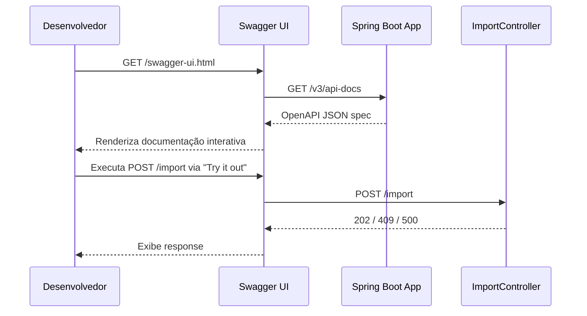

# Documento de Design: Swagger/OpenAPI Docs

## Visão Geral

Adicionar documentação interativa OpenAPI 3.0 à aplicação ETL Importer utilizando SpringDoc OpenAPI. A integração expõe um Swagger UI em `/swagger-ui.html` e disponibiliza o spec JSON/YAML em `/v3/api-docs`, documentando todos os endpoints do `ImportController` com seus respectivos códigos de resposta HTTP.

## Fluxo Principal



## Interfaces e Tipos Principais

```java
// Dependência Maven: springdoc-openapi-starter-webmvc-ui 2.8.x
// Compatível com Spring Boot 4.1.0 (Jakarta EE, Spring Framework 7.x)

// Classe de configuração OpenAPI
@Configuration
public class OpenApiConfig {

    @Bean
    public OpenAPI customOpenAPI() {
        return new OpenAPI()
            .info(new Info()
                .title("ETL Importer API")
                .version("1.0.0")
                .description("API para importação de dados de vendas via processamento batch CSV."));
    }
}
```

## Funções-Chave com Especificações Formais

### Anotações no ImportController

```java
@Tag(name = "Importação", description = "Endpoints para gerenciamento de importações de vendas")
@RestController
@RequestMapping("/import")
public class ImportController {

    @Operation(
        summary = "Iniciar importação de vendas",
        description = "Lança um job batch para importar dados de vendas a partir do arquivo CSV."
    )
    @ApiResponse(responseCode = "202", description = "Job de importação iniciado com sucesso",
        content = @Content(schema = @Schema(implementation = ImportExecution.class)))
    @ApiResponse(responseCode = "409", description = "Já existe um job de importação em execução",
        content = @Content(schema = @Schema(implementation = String.class)))
    @ApiResponse(responseCode = "500", description = "Erro interno ao iniciar o job de importação",
        content = @Content(schema = @Schema(implementation = String.class)))
    @PostMapping
    public ResponseEntity<?> importData() { /* ... */ }

    @Operation(
        summary = "Consultar status de importação",
        description = "Retorna o status e progresso de uma execução de importação pelo ID."
    )
    @ApiResponse(responseCode = "200", description = "Execução encontrada",
        content = @Content(schema = @Schema(implementation = ImportExecution.class)))
    @ApiResponse(responseCode = "404", description = "Execução não encontrada")
    @GetMapping("/{id}")
    public ResponseEntity<ImportExecution> getStatus(@PathVariable Long id) { /* ... */ }
}
```

**Pré-condições:**
- A dependência `springdoc-openapi-starter-webmvc-ui` deve estar presente no classpath
- A aplicação Spring Boot deve iniciar sem erros de configuração

**Pós-condições:**
- O endpoint `/v3/api-docs` retorna JSON válido no formato OpenAPI 3.0
- O Swagger UI renderiza corretamente em `/swagger-ui.html`
- Todos os endpoints do controller aparecem documentados com seus schemas de response

### Modelo de Response (Schema)

```java
@Schema(description = "Representa uma execução de importação de vendas")
@Entity
public class ImportExecution {

    @Schema(description = "ID único da execução", example = "1")
    private Long id;

    @Schema(description = "Nome do arquivo importado", example = "sales_100000.csv")
    private String filename;

    @Schema(description = "Data/hora de início da execução")
    private LocalDateTime startedDate;

    @Schema(description = "Data/hora de término da execução (null se em andamento)")
    private LocalDateTime finishedDate;

    @Schema(description = "Status atual da execução", example = "RUNNING")
    private ExecutionStatusEnum status;

    @Schema(description = "Total de linhas no arquivo", example = "100000")
    private Long totalLines;

    @Schema(description = "Linhas processadas até o momento", example = "45000")
    private Long processedLines;

    @Schema(description = "Linhas importadas com sucesso", example = "44500")
    private Long successLines;

    @Schema(description = "Linhas com erro", example = "500")
    private Long errorLines;

    @Schema(description = "Duração em milissegundos", example = "12345")
    private Long duration;
}
```

## Configuração via application.properties

```properties
# SpringDoc OpenAPI
springdoc.swagger-ui.path=/swagger-ui.html
springdoc.api-docs.path=/v3/api-docs
```

## Exemplo de Uso

```java
// 1. Adição ao pom.xml
// <dependency>
//     <groupId>org.springdoc</groupId>
//     <artifactId>springdoc-openapi-starter-webmvc-ui</artifactId>
//     <version>2.8.6</version>
// </dependency>

// 2. Configuração criada em:
// src/main/java/.../config/OpenApiConfig.java

// 3. Anotações adicionadas ao ImportController

// 4. Anotações @Schema adicionadas ao modelo ImportExecution

// 5. Propriedades adicionadas ao application.properties

// Resultado: Swagger UI acessível em http://localhost:8080/swagger-ui.html
```

## Propriedades de Corretude

*Uma propriedade é uma característica ou comportamento que deve se manter verdadeiro em todas as execuções válidas do sistema — essencialmente, uma declaração formal sobre o que o sistema deve fazer.*

### Propriedade 1: Spec OpenAPI válida

*Para qualquer* estado válido da aplicação em execução, o endpoint `/v3/api-docs` deve retornar um documento JSON que é um OpenAPI 3.0 spec válido (parseável e aderente ao schema OpenAPI).

**Validates: Requisitos 5.5**

### Propriedade 2: Cobertura completa de endpoints

*Para qualquer* endpoint anotado com `@RequestMapping` no controller, esse endpoint deve aparecer na spec OpenAPI retornada por `/v3/api-docs` com todos os códigos de resposta HTTP documentados.

**Validates: Requisitos 3.2, 3.3, 3.4**

### Propriedade 3: Metadados globais presentes

*Para qualquer* resposta do endpoint `/v3/api-docs`, o campo `info` deve conter `title`, `version` e `description` preenchidos e não vazios.

**Validates: Requisitos 5.2, 5.3, 5.4**
