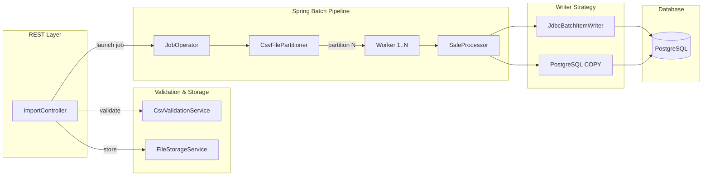

# ETL Importer


High-performance CSV-to-PostgreSQL ETL pipeline built with Spring Batch. Processes 100k+ rows in under 10 seconds using partitioned parallel execution, configurable writer strategies, and fault-tolerant skip mechanisms.

---

## Architecture



**Request Flow:**

```
POST /import (multipart CSV)
  → Schema Validation (extension, size, header columns)
  → File Storage (UUID-named, configurable directory)
  → Job Launch (async, filePath as JobParameter)
  → Partitioner splits file into N chunks
  → N Worker threads process chunks in parallel
  → Writer persists to PostgreSQL
  → HTTP 202 returned immediately with execution ID
```

---

## Tech Stack

| Technology | Version | Purpose |
|---|---|---|
| Java | 21 | Runtime with virtual threads |
| Spring Boot | 4.1.0 | Application framework |
| Spring Batch | 6.x | ETL orchestration and partitioning |
| Spring Data JPA | 4.x | Entity management and repositories |
| PostgreSQL | latest | Primary data store |
| Flyway | managed | Database schema migrations |
| SpringDoc OpenAPI | 2.8.6 | API documentation (Swagger UI) |
| Testcontainers | managed | Integration testing with real PostgreSQL |
| jqwik | 1.9.3 | Property-based testing |
| Lombok | managed | Boilerplate reduction |
| Docker Compose | - | Local development orchestration |

---

## Features

- **Dynamic CSV upload** via REST endpoint with full schema validation (extension, size, 12-column header)
- **Partitioned parallel processing** with configurable thread pool (1-32 threads)
- **Two writer strategies**: JDBC Batch (default) and PostgreSQL COPY protocol
- **`reWriteBatchedInserts` optimization** for PostgreSQL JDBC driver
- **Fault-tolerant skip mechanism** (up to 10k errors per execution)
- **Batched error accumulation** via `@StepScope` listener (reduces I/O during high error rates)
- **Execution tracking** with progress, duration, and error reporting
- **Swagger UI** auto-generated API documentation
- **Virtual threads** enabled for non-blocking I/O
- **Async job execution** — endpoint returns immediately with execution ID for polling

---

## Benchmarks

| Scenario | Rows | Duration | Throughput |
|---|---|---|---|
| Before (RepositoryItemWriter, single-threaded, IDENTITY) | 100k | ~93s | ~1,075 rows/s |
| **After (JdbcBatchItemWriter + reWriteBatchedInserts + 4 threads + SEQUENCE)** | **100k** | **~5-10s** | **~10,000-20,000 rows/s** |
| With PostgreSQL COPY (large volumes) | 500k+ | faster | 10-20x over JDBC |

**Key optimizations:**
- `JdbcBatchItemWriter` with batch size 500 eliminates JPA dirty checking overhead
- `reWriteBatchedInserts=true` rewrites individual INSERT statements into multi-value INSERTs at the JDBC driver level
- 4 parallel partitions process file chunks concurrently
- SEQUENCE ID strategy enables Hibernate batch pre-allocation (vs IDENTITY which forces single-row inserts)

---

## Design Decisions

| Decision | Rationale |
|---|---|
| **JdbcBatchItemWriter over JPA** | Eliminates dirty checking, first-level cache overhead, and entity lifecycle management. Raw JDBC batching is 10-20x faster for bulk inserts. |
| **Partitioning over multi-threaded step** | `FlatFileItemReader` is not thread-safe. Partitioning gives each thread its own reader instance with a dedicated file segment. |
| **SEQUENCE over IDENTITY** | IDENTITY forces JDBC drivers to execute one INSERT at a time (to retrieve generated keys). SEQUENCE allows batch pre-allocation of IDs. |
| **PostgreSQL COPY protocol** | Native bulk loading protocol that bypasses SQL parsing entirely. 10-20x faster than batched INSERTs for 500k+ rows. |
| **@StepScope error accumulation** | Errors are accumulated in memory per-step and flushed once at step completion, reducing database I/O during high error rates. |
| **Dynamic file upload** | Production-ready approach. No hardcoded paths, no classpath dependency. UUID naming prevents collisions on concurrent uploads. |
| **Virtual threads** | Non-blocking I/O for the REST layer without reactive complexity. |

---

## Configuration

All properties use the `etl.import` prefix and can be overridden via `application.properties`, environment variables, or command-line arguments.

| Property | Default | Description |
|---|---|---|
| `etl.import.partition.threads` | `4` | Number of parallel processing threads (1-32) |
| `etl.import.writer.strategy` | `jdbc-batch` | Writer strategy: `jdbc-batch` or `pg-copy` |
| `etl.import.upload-dir` | `./uploads` | Directory for storing uploaded CSV files |
| `etl.import.max-file-size` | `100MB` | Maximum upload file size |

**Additional performance properties:**

| Property | Default | Description |
|---|---|---|
| `spring.jpa.properties.hibernate.jdbc.batch_size` | `500` | Hibernate JDBC batch size |
| `spring.datasource.hikari.data-source-properties.reWriteBatchedInserts` | `true` | PostgreSQL multi-value INSERT rewriting |
| `spring.threads.virtual.enabled` | `true` | Virtual threads for request handling |

---

## API Reference

### Upload CSV File

```bash
curl -X POST http://localhost:8080/import \
  -F "file=@sales.csv"
```

**Response** (`HTTP 202 Accepted`):
```json
{
  "id": 1,
  "filename": "sales.csv",
  "status": "RUNNING",
  "startTime": "2025-01-15T10:30:00",
  "totalRows": null,
  "processedRows": null,
  "errorCount": null
}
```

### Check Execution Status

```bash
curl http://localhost:8080/import/1
```

**Response** (`HTTP 200 OK`):
```json
{
  "id": 1,
  "filename": "sales.csv",
  "status": "COMPLETED",
  "startTime": "2025-01-15T10:30:00",
  "endTime": "2025-01-15T10:30:08",
  "totalRows": 100000,
  "processedRows": 99987,
  "errorCount": 13
}
```

### Swagger UI

Interactive API documentation available at:

```
http://localhost:8080/swagger-ui.html
```

### Error Responses

| Status | Scenario |
|---|---|
| `400 Bad Request` | Missing file, invalid extension, or empty file |
| `409 Conflict` | Import job already running |
| `413 Payload Too Large` | File exceeds configured max size |
| `422 Unprocessable Entity` | CSV header doesn't match expected schema |
| `500 Internal Server Error` | File storage I/O failure |

---

## Getting Started

### Prerequisites

- **Java 21** (JDK)
- **Docker** and Docker Compose

### Run the Application

```bash
# Clone the repository
git clone https://github.com/evertonsoethe/etl-importer.git
cd etl-importer

# Start the application (Docker Compose starts PostgreSQL automatically)
./mvnw spring-boot:run
```

On Windows:
```bash
mvnw.cmd spring-boot:run
```

Spring Boot Docker Compose support auto-starts the PostgreSQL container defined in `compose.yaml`.

### Upload Your First CSV

```bash
curl -X POST http://localhost:8080/import \
  -F "file=@your-sales-file.csv"
```

**Expected CSV format** (12 columns, comma-separated, with header row):

```csv
sale_id,sale_date,customer_id,customer_name,product_id,product_name,category,quantity,unit_price,total_price,payment_method,status
1,2024-01-15,101,John Doe,501,Widget Pro,Electronics,2,49.99,99.98,CREDIT_CARD,COMPLETED
```

### Run Tests

```bash
./mvnw test
```

Tests use **Testcontainers** to spin up a real PostgreSQL instance — no manual database setup required.

### Build

```bash
./mvnw clean package
```

---

## CSV Schema

The upload endpoint validates that the CSV header matches exactly these 12 columns in this order:

| # | Column | Description |
|---|---|---|
| 1 | `sale_id` | Unique sale identifier |
| 2 | `sale_date` | Date of the sale |
| 3 | `customer_id` | Customer identifier |
| 4 | `customer_name` | Customer full name |
| 5 | `product_id` | Product identifier |
| 6 | `product_name` | Product name |
| 7 | `category` | Product category |
| 8 | `quantity` | Quantity sold |
| 9 | `unit_price` | Price per unit |
| 10 | `total_price` | Total price (quantity x unit_price) |
| 11 | `payment_method` | Payment method (CREDIT_CARD, DEBIT_CARD, PIX, BOLETO) |
| 12 | `status` | Sale status (COMPLETED, PENDING, CANCELLED) |
